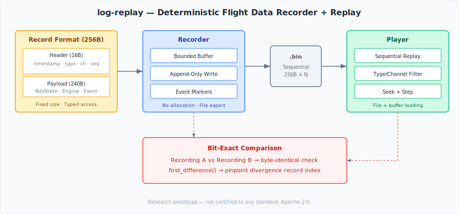

# log-replay

A deterministic flight data recorder and bit-exact replay system for avionics research.

## What This Is

`log-replay` provides the recording and replay infrastructure for flight data:

- **Format** — Fixed 256-byte binary records with typed payloads, monotonic sequencing, and channel tagging
- **Recorder** — Bounded, append-only buffer with no dynamic allocation. Writes to binary files for offline analysis
- **Player** — Sequential replay with type/channel filtering, seeking, and bit-exact comparison between recordings

Every avionics system needs a flight data recorder. This one is designed for determinism — same inputs produce identical recordings, and two recordings can be compared byte-for-byte.

## Architecture



```
include/logrep/
├── format/
│   └── record.hpp               # 256-byte Record struct, RecordType enum, typed payload access
├── recorder/
│   └── recorder.hpp             # Bounded append-only buffer, file export, event markers
└── replay/
    └── player.hpp               # File/buffer loading, filtered replay, seek, bit-exact compare
```

## Quick Start

```bash
mkdir build && cd build
cmake .. -DCMAKE_BUILD_TYPE=Release
cmake --build . -j$(nproc)

# Run tests
./test_logrep
```

## Record Format

Each record is exactly 256 bytes:

```
┌─────────────────────────────────────────────┐
│ Header (16 bytes)                           │
│   timestamp_ns (8B) | type (1B) | ch (1B)  │
│   payload_len (2B)  | sequence (4B)         │
├─────────────────────────────────────────────┤
│ Payload (240 bytes)                         │
│   Typed data (NavState, Engine, etc.)       │
└─────────────────────────────────────────────┘
```

Fixed size enables memory-mapped access, sequential I/O, and simple seeking.

## Bit-Exact Comparison

```cpp
Player recording_a, recording_b;
recording_a.load("flight_001.bin");
recording_b.load("flight_001_rerun.bin");

if (Player::compare(recording_a, recording_b)) {
    // Recordings are byte-identical
} else {
    long idx = Player::first_difference(recording_a, recording_b);
    // First divergence at record idx
}
```

## Test Results

| Test | Result | Notes |
|------|--------|-------|
| Record and readback | ✅ | Typed NavState payload roundtrip |
| Capacity enforcement | ✅ | Rejects writes when buffer full |
| File write + replay | ✅ | Binary file roundtrip, 10 records |
| Filtered replay | ✅ | Type-based filtering (3 nav, 2 engine) |
| Bit-exact comparison | ✅ | Identical recordings verified |
| Divergence detection | ✅ | Corruption detected at record 3 |

> **Note:** Results are reproducible under controlled conditions but may vary across platforms.

## Design Constraints

- C++23, CMake ≥ 3.25
- `-Wall -Wextra -Wpedantic -Werror`
- Header-only recorder (player uses `std::vector` for file loading)
- Fixed 256-byte records — no variable-length encoding
- Bounded buffer — no dynamic allocation in the recording path
- `CLOCK_MONOTONIC` timestamps throughout

## Dependencies

None. Pure C++23 standard library.

## Portfolio Context

`log-replay` is part of the [avionics-lab](https://github.com/yablokolabs/avionics-lab) research portfolio:

| Repository | Role |
|-----------|------|
| [partition-guard](https://github.com/yablokolabs/partition-guard) | Time/space isolation |
| [comm-bus](https://github.com/yablokolabs/comm-bus) | Deterministic data bus |
| [wcet-probe](https://github.com/yablokolabs/wcet-probe) | Execution timing characterization |
| [virt-jitter-lab](https://github.com/yablokolabs/virt-jitter-lab) | Virtualization latency measurement |
| [track-core](https://github.com/yablokolabs/track-core) | Probabilistic state estimation |
| [detframe](https://github.com/yablokolabs/detframe) | Deterministic rendering |
| [nav-sim](https://github.com/yablokolabs/nav-sim) | Flight phase + mode management |
| **log-replay** | **Flight data recording + replay** |
| [health-mon](https://github.com/yablokolabs/health-mon) | TMR voting + health monitoring |
| [fault-inject](https://github.com/yablokolabs/fault-inject) | Fault injection + resilience testing |

## License

Apache-2.0. See [LICENSE](LICENSE).
